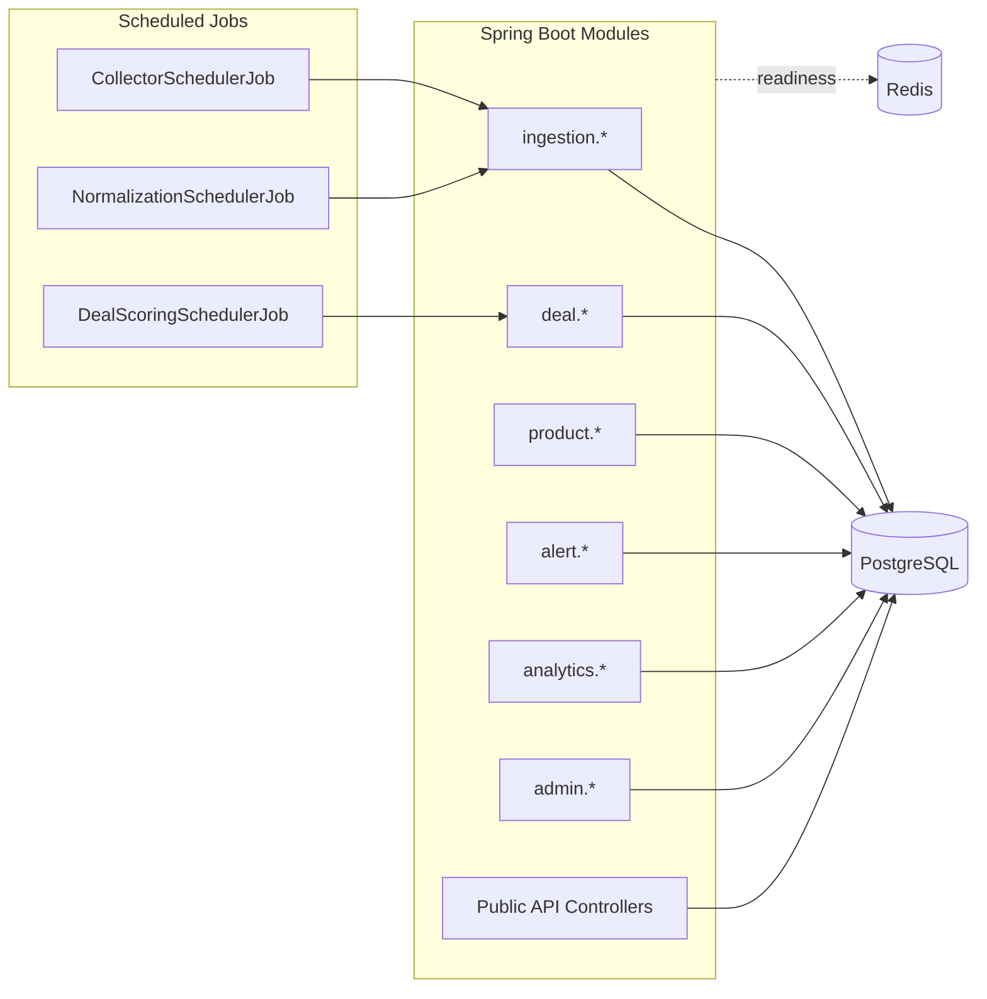

# Architecture Overview

## 1. Purpose

This document describes the current runtime architecture implemented in this repository (through Phase 13).  
It intentionally reflects existing code paths, not target-state theory.

## 2. System Context

The service ingests raw deal data, normalizes and deduplicates it, persists canonical deal/product state, tracks price history, computes score/analytics, and exposes public/admin APIs.

External dependencies currently in use:

- PostgreSQL (primary data store)
- Redis (configured and part of readiness checks; caching is not yet implemented)
- Docker runtime for local and test environments

## 3. Architectural Style

- **Style**: Modular monolith
- **Framework**: Spring Boot 3.5.8
- **Language**: Java 21
- **Scheduling**: Spring `@Scheduled` jobs
- **Migrations**: Flyway SQL migrations

Why this is suitable now:

- Single deployable with clear module boundaries
- Fast local iteration
- Explicit extension points (collector registry, mapper registry, notifier abstraction)
- Straightforward path to split high-throughput modules later if needed

## 4. Module Boundaries

- `ingestion`: source metadata, collector orchestration, raw ingestion persistence
- `deal`: canonical deal model, deduplication, pricing snapshots, scoring, public query
- `product`: canonical product persistence and matching support
- `analytics`: aggregate metrics for homepage/admin dashboards
- `alert`: alert rules, matching, delivery log, notifier abstraction
- `admin`: operational APIs (job history, source health, failed raw records, reprocess)
- `common`: response envelope, pagination, exception hierarchy, global handler, correlation logging
- `config`: security, OpenAPI, scheduling, validation, audit clock

## 5. Runtime Components

## 6. Data Processing Path

1. `CollectorSchedulerJob` loads active `source` records and runs collectors.
2. `CollectorOrchestrationService` applies retry policy and stores run metadata in `collector_job_execution`.
3. `RawDealPersistenceService` inserts/updates `raw_deal` with idempotency keys and hashes.
4. `NormalizationSchedulerJob` processes `raw_deal.status=NEW`.
5. `DealNormalizationService`:
   - maps payload (`RawDealMapperRegistry`)
   - validates normalized record
   - resolves dedup/product (`DealDeduplicationService`)
   - upserts `deal`
   - captures price snapshot + score
   - matches active alerts
6. Admin APIs expose job/raw health and can reprocess one failed raw record.

## 7. Scheduling and Concurrency

Implemented scheduled jobs:

- Collector: `CollectorSchedulerJob`
- Normalization: `NormalizationSchedulerJob`
- Scoring refresh: `DealScoringSchedulerJob`

Safety controls:

- Each scheduler has an `AtomicBoolean` guard to skip overlapping runs in one JVM.
- Cron expressions and enable flags are environment-configurable.

Note:

- Quartz dependency/config exists, but the implemented jobs currently run via Spring `@Scheduled`.

## 8. Idempotency and Consistency

Current idempotency strategy:

- Raw layer:
  - unique `(source_id, source_record_key)` (partial)
  - unique `(source_id, source_record_hash)` (partial)
- Canonical deal upsert lookup order:
  1. `(source_id, source_deal_id)`
  2. `(source_id, fingerprint)`
  3. `(source_id, dedupe_key)` latest
- Alert delivery de-dup:
  - unique sent constraint per `(alert_rule_id, deal_id)` where status = `SENT`

## 9. Failure Handling

- Collector failures:
  - retried per configured attempts/backoff
  - job marked `FAILED`/`PARTIAL`
  - source failure metadata updated
- Normalization failures:
  - raw record marked `REJECTED` (validation) or `ERROR` (runtime)
  - parse error persisted
- Manual recovery:
  - `/api/v1/admin/raw-deals/{id}/reprocess` resets failed raw record and retries normalization

## 10. Observability

Implemented:

- Structured key-value console logs
- Correlation ID via `X-Correlation-Id` (generated if missing)
- Actuator endpoints: health/info/metrics/prometheus
- Readiness group includes DB and Redis checks

Not yet implemented:

- Centralized tracing backend
- SLO/alert definitions
- Log retention policy automation

## 11. Security Model (Current)

- `/api/v1/admin/**` requires HTTP Basic role `ADMIN`
- Public and alert endpoints are currently open
- Credentials come from `app.security.*` properties

Limitations:

- No JWT/OIDC integration yet
- No endpoint-level permissions beyond admin path boundary

## 12. Assumptions and Current Limitations

- Single service instance is the default deployment assumption.
- Deduplication strategy is deterministic but heuristic (title/brand/fingerprint based).
- Analytics is query-time aggregation on `deal` table (no pre-aggregation layer).
- Redis is provisioned but not used for query/result caching yet.
