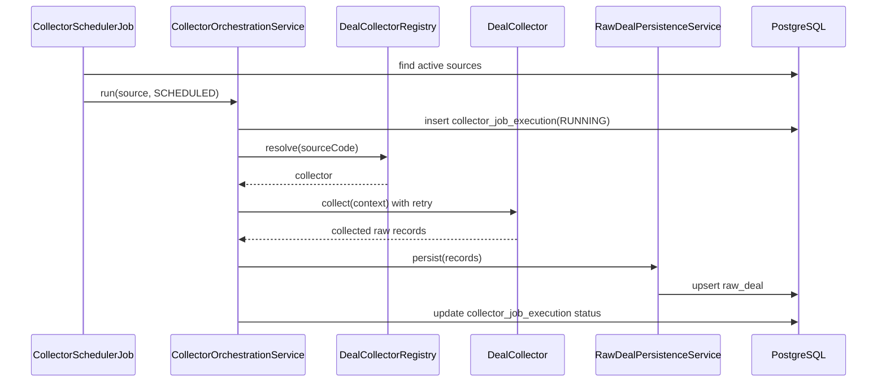
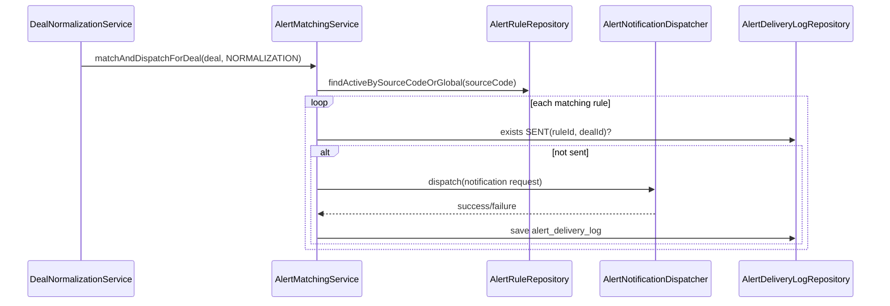

# Business Flows

This document captures the implemented runtime flows and operational behavior.

## 1. Source Collection Flow

Trigger:

- `CollectorSchedulerJob` on cron (`app.ingestion.scheduler.cron`)

Steps:

1. Load active sources (`source.status=ACTIVE`)
2. Resolve collector via `DealCollectorRegistry`
3. Create `collector_job_execution` record (`RUNNING`)
4. Execute collector with retry policy
5. Persist raw records (`raw_deal`)
6. Mark job `SUCCESS|PARTIAL|FAILED`
7. Update source success/failure markers

Failure behavior:

- Retry attempts: `app.ingestion.retry.max-attempts`
- Backoff: `app.ingestion.retry.backoff-ms`
- Final failure persists job/source error metadata

## 2. Raw Persistence and Idempotency Flow

Record-level idempotency order:

1. `(source_id, source_record_key)`
2. `(source_id, source_record_hash)`
3. `(source_id, source_deal_id)`

If existing row found:

- payload and metadata updated
- status reset to `NEW` for normalization

If no match:

- new `raw_deal` inserted with `status=NEW`

## 3. Normalization Flow

Trigger:

- `NormalizationSchedulerJob` or admin single-record reprocess

Steps:

1. Load pending rows (`raw_deal.status=NEW`)
2. Resolve mapper via `RawDealMapperRegistry`
3. Convert payload to `NormalizedDealRecord`
4. Validate business fields (`NormalizationValidationService`)
5. Dedup + product linking
6. Upsert canonical `deal`
7. Snapshot price + compute score
8. Match and dispatch alerts
9. Mark raw row `NORMALIZED`

Failure behavior:

- Validation errors -> `raw_deal.status=REJECTED`
- Runtime errors -> `raw_deal.status=ERROR`

## 4. Deduplication and Product Linking Flow

Implemented strategy:

- Cleaned normalized title (`NormalizedTitleCleaner`)
- Optional brand token
- Optional coupon token
- SHA-256 fingerprint and dedupe key

Product matching order (`ProductMatchingService`):

1. canonical SKU from raw payload (sku/upc/ean/gtin/asin)
2. fingerprint
3. normalized name + brand heuristic
4. create new product (with race-condition fallback lookup)

Decision trace is stored in `deal.metadata.deduplication`.

## 5. Price History and Scoring Flow

When a deal is normalized (and by scoring scheduler):

1. `PriceHistoryService.captureSnapshotIfNeeded`
   - creates snapshot when price/currency/availability changes or min interval elapsed
2. `DealScoringService.scoreAndPersist`
   - discount contribution
   - status contribution
   - source confidence contribution
   - price-position vs recent lowest contribution

Output:

- `deal.deal_score` updated
- score breakdown stored in `deal.metadata.scoreBreakdown`

## 6. Alert Matching and Delivery Flow

Trigger:

- After each normalized deal update
- Bootstrap scan when new alert rule is created

Steps:

1. Load active rules (`global` + source-specific)
2. Filter with `AlertRuleMatcher`:
   - active deal only
   - keyword/category/source/maxPrice/minDiscount
3. Check sent de-dup by `(alert_rule_id, deal_id, SENT)`
4. Dispatch notifier via `AlertNotificationDispatcher`
5. Persist `alert_delivery_log`
6. If sent: update `alert_rule.last_triggered_at`

## 7. Admin Reprocess Flow

Endpoint:

- `POST /api/v1/admin/raw-deals/{rawDealId}/reprocess`

Steps:

1. Verify raw record exists
2. Verify status is reprocessable (`ERROR` or `REJECTED`)
3. Reset raw record (`NEW`, clear parse error)
4. Run `normalizeRawDeal(rawDealId)`
5. Return normalization outcome (`NORMALIZED|REJECTED|ERROR`)

Audit trail:

- Action and actor logged with structured log lines.

## 8. Analytics Aggregation Flow

Endpoint:

- `GET /api/v1/analytics/summary`
- `GET /api/v1/admin/analytics/summary`

Current strategy:

- on-demand SQL aggregations from `deal` table:
  - active count
  - expired count
  - average discount
  - grouped counts by source and category
  - hottest deals ordered by score/discount/lastSeen

Limitation:

- no materialized/pre-aggregated store yet.
