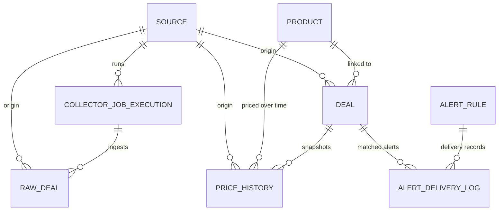

# Domain Model

## 1. Scope

This document describes the persisted model implemented by Flyway migrations:

- `V1__initial_schema.sql`
- `V2__dedup_product_linking_indexes.sql`
- `V3__alert_rule_module.sql`

## 2. Core Entities

### Ingestion

- `source`: source registry and health markers
- `collector_job_execution`: ingestion run history
- `raw_deal`: raw payload storage + normalization status

### Canonical Commerce

- `product`: canonical product identity
- `deal`: normalized/canonical deal record
- `price_history`: immutable-ish snapshots for pricing timeline

### Alerts

- `alert_rule`: subscriber matching criteria
- `alert_delivery_log`: delivery attempts and de-dup evidence

## 3. ERD (Current)

## 4. Table Details

### `source`

Purpose: master registry of data providers and source-level health.

Important columns:

- `code` (unique business key)
- `status` (`ACTIVE|PAUSED|DISABLED`)
- `last_success_at`, `last_failure_at`, `last_error_message`
- `metadata` (JSONB)

Important indexes:

- `uk_source_code`
- `idx_source_status`
- `idx_source_type_status`

### `collector_job_execution`

Purpose: operational trail for collector runs.

Important columns:

- `run_key` (unique run identity)
- `status` (`RUNNING|SUCCESS|FAILED|PARTIAL|CANCELLED`)
- counters: `total_fetched`, `total_persisted`, `total_failed`
- `details` (JSONB, includes attempts/inserted/updated/failed)

Important indexes:

- `uk_collector_job_execution_run_key`
- `idx_collector_job_execution_source_started`
- `idx_collector_job_execution_status_started`

### `raw_deal`

Purpose: immutable-ish raw payload store + normalization queue state.

Important columns:

- source identifiers: `source_deal_id`, `source_record_key`, `source_record_hash`
- `payload` (JSONB)
- `status` (`NEW|NORMALIZED|REJECTED|DUPLICATE|ERROR`)
- `parse_error`
- `ingested_at`, `normalized_at`

Idempotency constraints:

- unique `(source_id, source_record_key)` when key is not null
- unique `(source_id, source_record_hash)` when hash is not null

Indexes:

- `idx_raw_deal_status_ingested`
- `idx_raw_deal_source_deal_id`
- `idx_raw_deal_job_execution`

### `product`

Purpose: canonical product identity for cross-deal linking.

Important columns:

- `canonical_sku` (optional unique)
- `fingerprint` (optional unique)
- `normalized_name`, `brand`, `category`
- `attributes` (JSONB)

Indexes:

- `uk_product_canonical_sku`
- `uk_product_fingerprint`
- `idx_product_normalized_name`
- `idx_product_brand`
- `idx_product_category`
- `idx_product_normalized_name_brand` (V2)

### `deal`

Purpose: normalized canonical deal record exposed to APIs.

Important columns:

- relation keys: `source_id`, `product_id`
- idempotency keys: `source_deal_id`, `fingerprint`, `dedupe_key`
- pricing fields: `original_price`, `deal_price`, `discount_percent`
- ranking field: `deal_score`
- status: `ACTIVE|EXPIRED|INACTIVE`
- timeline: `first_seen_at`, `last_seen_at`, `valid_from`, `valid_until`
- `metadata` (JSONB) including dedup trace and raw payload snapshot

Constraints and indexes:

- unique `(source_id, source_deal_id)` (partial)
- `idx_deal_source_dedupe_key_last_seen` (V2)
- `idx_deal_status_valid_until`
- `idx_deal_category_status`
- `idx_deal_last_seen`

### `price_history`

Purpose: time-series snapshots for historical price and scoring lookback.

Important columns:

- `deal_id`, optional `product_id`, `source_id`
- `captured_at`
- `deal_price`, `original_price`, `discount_percent`
- availability status (`IN_STOCK|OUT_OF_STOCK|UNKNOWN`)

Constraints and indexes:

- unique `(deal_id, captured_at)`
- `idx_price_history_deal_captured`
- `idx_price_history_product_captured`
- `idx_price_history_source_captured`

### `alert_rule`

Purpose: user/subscriber-owned match conditions.

Important columns:

- `subscriber_key`
- conditions: `keyword`, `category`, `source_code`, `max_price`, `min_discount_percent`
- delivery setup: `notification_channel`, `notification_target`
- `status` (`ACTIVE|DISABLED`)

Indexes:

- `idx_alert_rule_subscriber_status`
- `idx_alert_rule_source_status`
- `idx_alert_rule_created_at`

### `alert_delivery_log`

Purpose: delivery audit log and de-dup gate.

Important columns:

- `alert_rule_id`, `deal_id`
- `delivery_status` (`SENT|FAILED`)
- `delivered_at`, `error_message`
- `payload` (JSONB)

Constraint:

- unique `(alert_rule_id, deal_id)` where status = `SENT`

## 5. Status and Enum Sets

- Source: `ACTIVE`, `PAUSED`, `DISABLED`
- Job status: `RUNNING`, `SUCCESS`, `FAILED`, `PARTIAL`, `CANCELLED`
- Job trigger: `SCHEDULED`, `MANUAL`, `RETRY`
- Raw deal status: `NEW`, `NORMALIZED`, `REJECTED`, `DUPLICATE`, `ERROR`
- Deal status: `ACTIVE`, `EXPIRED`, `INACTIVE`
- Availability: `IN_STOCK`, `OUT_OF_STOCK`, `UNKNOWN`
- Alert rule status: `ACTIVE`, `DISABLED`
- Notification channel: `INTERNAL_LOG`, `EMAIL`
- Alert delivery status: `SENT`, `FAILED`

## 6. How Schema Supports Current Behavior

### Idempotency support

- Raw ingestion is protected by source-scoped record key/hash uniqueness.
- Canonical deal upsert matches by source-deal-id/fingerprint/dedupe-key.

### Dedup and canonical linking support

- `deal.product_id` and product unique keys allow cross-source consolidation.
- `dedupe_key` + source-scoped indexes reduce duplicate canonical deals.

### Analytics support

- `deal.status`, `deal.category`, `deal.source_id`, `deal_score`, `last_seen_at` support summary and hottest queries.

## 7. Current Gaps and Limitations

- No dedicated `coupon` table yet (`coupon_code` is currently on `deal`).
- No dedicated category taxonomy table (category is plain string).
- No partitioning yet for `raw_deal`/`price_history`; large-volume retention strategy is pending.
