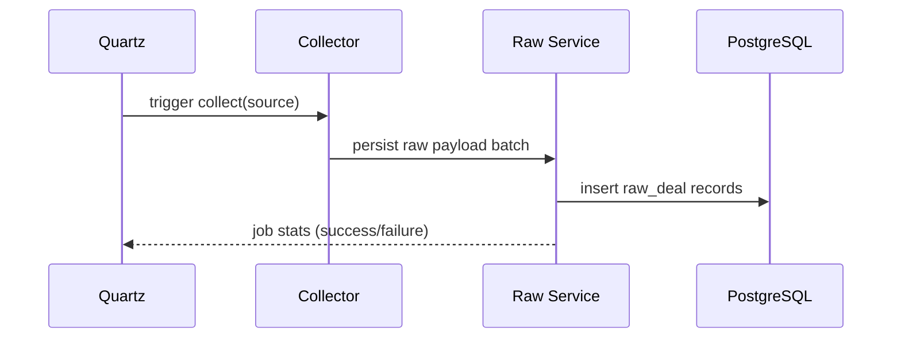
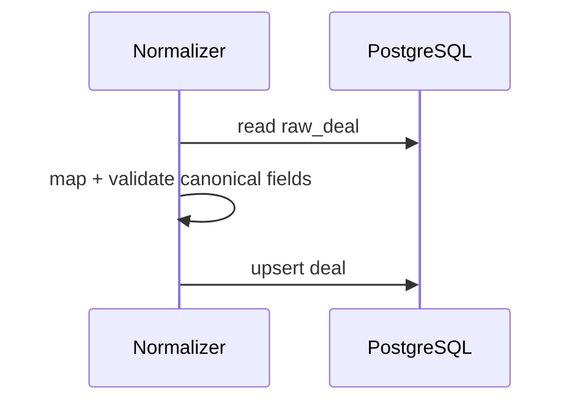
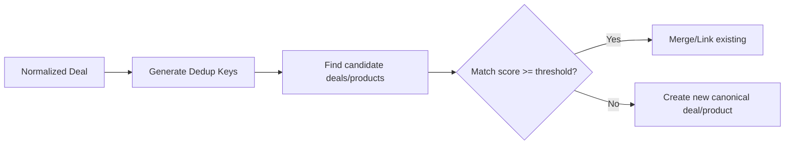
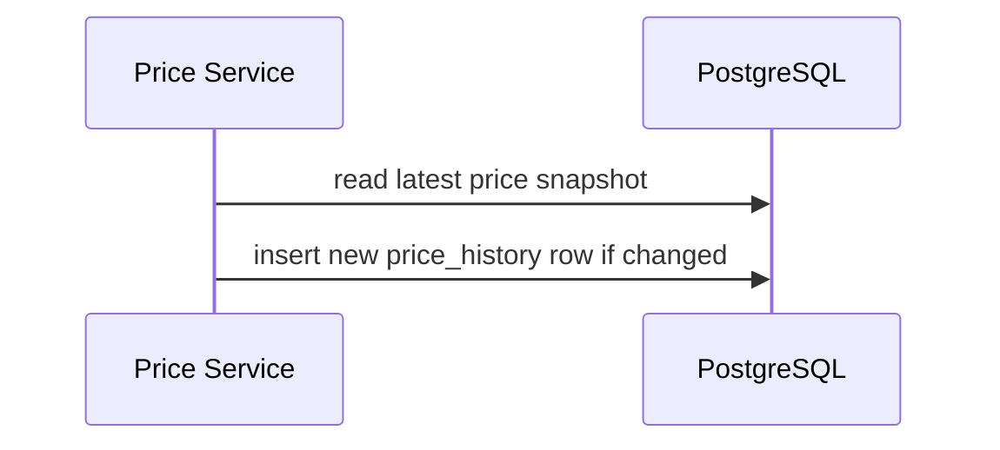
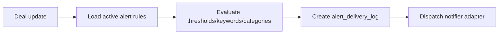

# Business and Processing Flows

## 1) Source Collection Flow
Trigger: Quartz job schedule.

## 2) Normalization Flow (Planned)
Trigger: new raw records or reprocess request.

## 3) Deduplication Flow (Planned)
Trigger: after normalization.

## 4) Price History Update Flow (Planned)
Trigger: new normalized deal snapshot.

## 5) Alert Match Flow (Planned)
Trigger: deal created/updated.

